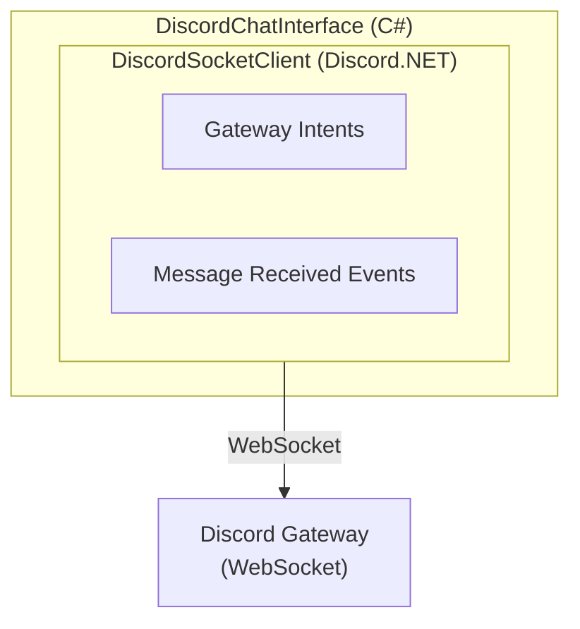

# Clawleash.Interfaces.Discord

A complete implementation of Discord Bot chat interface. Uses Discord.NET to receive messages from Discord servers and DMs, integrating with the AI agent.

## Features

- **Real-time Message Reception**: Real-time message monitoring using Gateway Intents
- **Command Prefix Support**: Identify commands with prefixes like `!`
- **Thread Replies**: Respond in reply format to original messages
- **DM Support**: Works in direct messages (no prefix required)
- **Streaming Send**: Support for batch sending of long messages

## Architecture



## Usage

### Settings

```csharp
var settings = new DiscordSettings
{
    Token = "YOUR_BOT_TOKEN",
    CommandPrefix = "!",
    UseThreads = false,
    UseEmbeds = true
};
```

### Basic Usage

```csharp
var chatInterface = new DiscordChatInterface(settings, logger);

// Event handler
chatInterface.MessageReceived += (sender, args) =>
{
    Console.WriteLine($"Message from {args.SenderName}: {args.Content}");
    Console.WriteLine($"Guild: {args.Metadata["GuildName"]}");
    Console.WriteLine($"Channel: {args.Metadata["ChannelName"]}");
    Console.WriteLine($"Is DM: {args.Metadata["IsDirectMessage"]}");
};

// Start
await chatInterface.StartAsync(cancellationToken);

// Send message (reply format)
await chatInterface.SendMessageAsync("Hello!", replyToMessageId);

// Dispose
await chatInterface.DisposeAsync();
```

## Configuration Options

| Property | Description | Default |
|-----------|------|-----------|
| `Token` | Discord Bot Token | (Required) |
| `CommandPrefix` | Command prefix (ignored in DMs) | `!` |
| `UseThreads` | Whether to reply in threads | `false` |
| `UseEmbeds` | Whether to use embed messages | `true` |

## Events

### MessageReceived

Event raised when a message is received.

```csharp
chatInterface.MessageReceived += (sender, args) =>
{
    // args.MessageId - Message ID
    // args.SenderId - Sender Discord ID
    // args.SenderName - Sender name (global name preferred)
    // args.Content - Message content (prefix removed)
    // args.ChannelId - Channel ID
    // args.Timestamp - Timestamp
    // args.Metadata["GuildId"] - Server ID
    // args.Metadata["GuildName"] - Server name
    // args.Metadata["ChannelName"] - Channel name
    // args.Metadata["IsDirectMessage"] - Whether it's a DM
    // args.Metadata["IsThread"] - Whether it's a thread
};
```

## Bot Setup

### Required Permissions

- **Read Messages**: Read messages
- **Send Messages**: Send messages
- **Read Message History**: Read message history (for replies)
- **View Channels**: View channels

### Gateway Intents

The following Intents are required:

- `MessageContent` - Read message content
- `GuildMessages` - Receive server messages
- `DirectMessages` - Receive DMs

## Troubleshooting

### "Privileged intent provided is not enabled"

Enable Message Content Intent in Bot settings:
1. Open Discord Developer Portal
2. Select the target application
3. Bot tab → Privileged Gateway Intents
4. Enable "Message Content Intent"

### "Discord token is not configured"

Verify Token is correctly set in `appsettings.json`:

```json
{
  "ChatInterface": {
    "Discord": {
      "Enabled": true,
      "Token": "${DISCORD_BOT_TOKEN}"
    }
  }
}
```

### Commands Not Responding

- Verify command prefix is correct
- Check if bot has access to the channel
- In DMs, send without prefix

## Build

```bash
cd Clawleash.Interfaces.Discord
dotnet build
```

## Dependencies

- Discord.NET (latest stable)
- Clawleash.Abstractions

## Related Projects

- [Clawleash.Abstractions](../Clawleash.Abstractions/README-en.md) - Shared interfaces

## License

MIT
