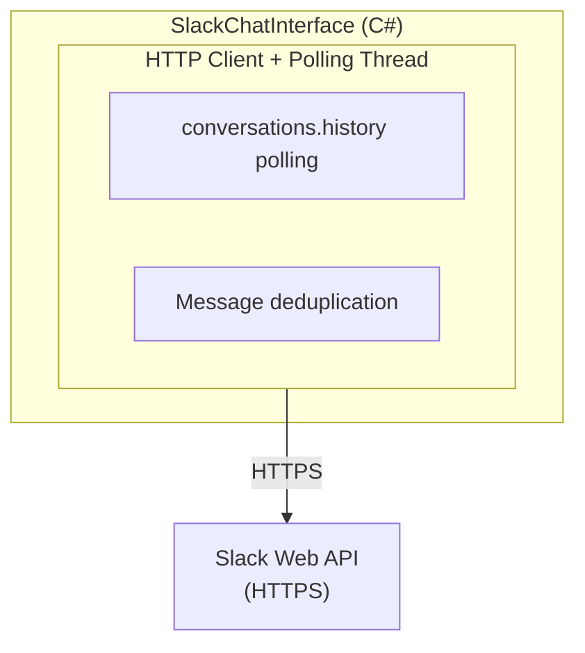

# Clawleash.Interfaces.Slack

A complete implementation of Slack Bot chat interface. Uses HTTP API + polling to receive messages from Slack, integrating with the AI agent.

## Features

- **HTTP API Polling**: Message retrieval using conversations.history API
- **Thread Replies**: Respond in thread format to original messages
- **DM Support**: Send and receive direct messages
- **Channel Management**: List, join, and leave channels
- **Streaming Send**: Support for batch sending of long messages

## Architecture



## Usage

### Settings

```csharp
var settings = new SlackSettings
{
    BotToken = "xoxb-...",
    AppToken = "xapp-...",
    UseThreads = true,
    UseBlockKit = false
};
```

### Basic Usage

```csharp
var chatInterface = new SlackChatInterface(settings, logger);

// Event handler
chatInterface.MessageReceived += (sender, args) =>
{
    Console.WriteLine($"Message from {args.SenderName}: {args.Content}");
    Console.WriteLine($"Thread: {args.Metadata["ThreadTs"]}");
    Console.WriteLine($"Is Thread: {args.Metadata["IsThread"]}");
};

// Start
await chatInterface.StartAsync(cancellationToken);

// Join channel
await chatInterface.JoinChannelAsync("C12345678");

// Send message (thread reply)
await chatInterface.SendMessageAsync("Hello!", replyToMessageId);

// Send DM
await chatInterface.SendDirectMessageAsync("U12345678", "Hello!");

// Dispose
await chatInterface.DisposeAsync();
```

## Configuration Options

| Property | Description | Default |
|-----------|------|-----------|
| `BotToken` | Bot User OAuth Token (`xoxb-...`) | (Required) |
| `AppToken` | App-Level Token (`xapp-...`) | (Empty) |
| `SigningSecret` | For HTTP request validation | `null` |
| `UseThreads` | Whether to reply in threads | `true` |
| `UseBlockKit` | Whether to use Block Kit | `false` |

## Events

### MessageReceived

Event raised when a message is received.

```csharp
chatInterface.MessageReceived += (sender, args) =>
{
    // args.MessageId - Message timestamp (ts)
    // args.SenderId - Sender Slack ID
    // args.SenderName - Sender display name
    // args.Content - Message content
    // args.ChannelId - Channel ID
    // args.Timestamp - Timestamp
    // args.Metadata["ThreadTs"] - Parent thread ts
    // args.Metadata["IsThread"] - Whether in thread
};
```

## Slack App Setup

### Required OAuth Scopes

- `channels:history` - Read public channel messages
- `groups:history` - Read private channel messages
- `im:history` - Read DM messages
- `mpim:history` - Read group DM messages
- `channels:read` - Get channel list
- `groups:read` - Get private channel list
- `im:read` - Get DM list
- `im:write` - Send DMs
- `chat:write` - Send messages

### App Setup Steps

1. Create an app at [Slack API](https://api.slack.com/apps)
2. Add the above Scopes in OAuth & Permissions
3. Install to Workspace
4. Copy the Bot User OAuth Token (`xoxb-...`)

## Polling Behavior

- **Polling Interval**: 5 seconds
- **Fetch Period**: Messages from the past 5 minutes
- **Deduplication**: Processed message IDs retained for 10 minutes

## Troubleshooting

### "Failed to authenticate with Slack"

Verify Bot Token is correct:
- Token starts with `xoxb-`
- Appropriate Scopes are granted

### Messages Not Received

1. Verify bot is invited to the channel
2. Add channel to monitoring with `JoinChannelAsync`
3. Verify required Scopes are granted

### "rate_limited"

Slack API rate limit reached:
- Increase polling interval
- Reduce number of monitored channels

## Build

```bash
cd Clawleash.Interfaces.Slack
dotnet build
```

## Dependencies

- System.Text.Json
- Clawleash.Abstractions

## Related Projects

- [Clawleash.Abstractions](../Clawleash.Abstractions/README-en.md) - Shared interfaces

## License

MIT
