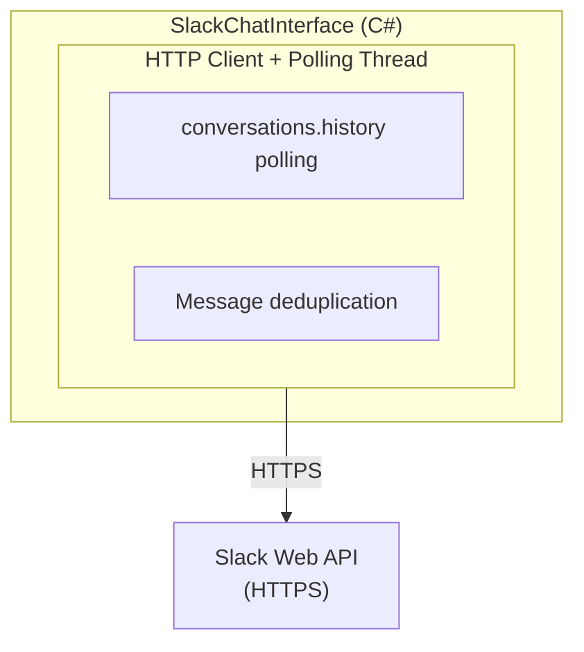

# Clawleash.Interfaces.Slack

Slack Bot チャットインターフェースの完全実装。HTTP API + ポーリング方式で Slack からメッセージを受信し、AI エージェントと連携します。

## 機能

- **HTTP API ポーリング**: conversations.history API を使用したメッセージ取得
- **スレッド返信**: 元のメッセージに対するスレッド形式で応答
- **DM 対応**: ダイレクトメッセージの送受信
- **チャンネル管理**: チャンネル一覧取得・参加・離脱
- **ストリーミング送信**: 長いメッセージの一括送信対応

## アーキテクチャ



## 使用方法

### 設定

```csharp
var settings = new SlackSettings
{
    BotToken = "xoxb-...",
    AppToken = "xapp-...",
    UseThreads = true,
    UseBlockKit = false
};
```

### 基本的な使用

```csharp
var chatInterface = new SlackChatInterface(settings, logger);

// イベントハンドラー
chatInterface.MessageReceived += (sender, args) =>
{
    Console.WriteLine($"Message from {args.SenderName}: {args.Content}");
    Console.WriteLine($"Thread: {args.Metadata["ThreadTs"]}");
    Console.WriteLine($"Is Thread: {args.Metadata["IsThread"]}");
};

// 開始
await chatInterface.StartAsync(cancellationToken);

// チャンネルに参加
await chatInterface.JoinChannelAsync("C12345678");

// メッセージ送信（スレッド返信）
await chatInterface.SendMessageAsync("Hello!", replyToMessageId);

// DM 送信
await chatInterface.SendDirectMessageAsync("U12345678", "Hello!");

// 終了
await chatInterface.DisposeAsync();
```

## 設定オプション

| プロパティ | 説明 | デフォルト |
|-----------|------|-----------|
| `BotToken` | Bot User OAuth Token (`xoxb-...`) | (必須) |
| `AppToken` | App-Level Token (`xapp-...`) | (空) |
| `SigningSecret` | HTTP リクエスト検証用 | `null` |
| `UseThreads` | スレッドで返信するかどうか | `true` |
| `UseBlockKit` | Block Kit を使用するかどうか | `false` |

## イベント

### MessageReceived

メッセージ受信時に発生するイベント。

```csharp
chatInterface.MessageReceived += (sender, args) =>
{
    // args.MessageId - メッセージタイムスタンプ (ts)
    // args.SenderId - 送信者 Slack ID
    // args.SenderName - 送信者表示名
    // args.Content - メッセージ内容
    // args.ChannelId - チャンネル ID
    // args.Timestamp - タイムスタンプ
    // args.Metadata["ThreadTs"] - スレッドの親 ts
    // args.Metadata["IsThread"] - スレッド内かどうか
};
```

## Slack App 設定

### 必要な OAuth Scopes

- `channels:history` - パブリックチャンネルのメッセージ読み取り
- `groups:history` - プライベートチャンネルのメッセージ読み取り
- `im:history` - DM のメッセージ読み取り
- `mpim:history` - グループ DM のメッセージ読み取り
- `channels:read` - チャンネル一覧取得
- `groups:read` - プライベートチャンネル一覧取得
- `im:read` - DM 一覧取得
- `im:write` - DM 送信
- `chat:write` - メッセージ送信

### App 設定手順

1. [Slack API](https://api.slack.com/apps) でアプリを作成
2. OAuth & Permissions で上記 Scopes を追加
3. Install to Workspace でインストール
4. Bot User OAuth Token (`xoxb-...`) をコピー

## ポーリング動作

- **ポーリング間隔**: 5 秒
- **取得期間**: 過去 5 分間のメッセージ
- **重複排除**: 処理済みメッセージ ID を 10 分間保持

## トラブルシューティング

### "Failed to authenticate with Slack"

Bot Token が正しいか確認してください：
- `xoxb-` で始まるトークン
- 適切な Scopes が付与されている

### メッセージが受信されない

1. Bot がチャンネルに招待されているか確認
2. `JoinChannelAsync` でチャンネルを監視対象に追加
3. 必要な Scopes が付与されているか確認

### "rate_limited"

Slack API のレート制限に達しました：
- ポーリング間隔を増やしてください
- 監視チャンネル数を減らしてください

## ビルド

```bash
cd Clawleash.Interfaces.Slack
dotnet build
```

## 依存関係

- System.Text.Json
- Clawleash.Abstractions

## 関連プロジェクト

- [Clawleash.Abstractions](../Clawleash.Abstractions/README.md) - 共有インターフェース

## ライセンス

MIT
