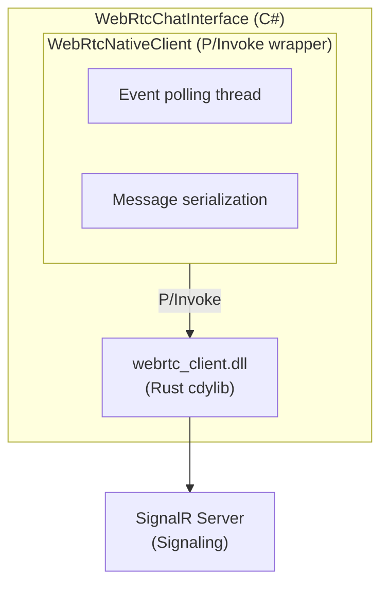

# Clawleash.Interfaces.WebRTC

A complete implementation of WebRTC chat interface. Establishes WebRTC P2P connections via SignalR signaling server and performs real-time communication through DataChannel.

## Features

- **Native WebRTC**: High-speed P2P communication using Rust (webrtc-rs) based native library
- **Fallback Support**: Works in simulation mode when native library is unavailable
- **E2EE Support**: End-to-end encryption for DataChannel communication
- **STUN/TURN**: NAT traversal support (configurable STUN/TURN servers)
- **Auto-Reconnect**: SignalR auto-reconnect and automatic peer connection recovery

## Architecture



## Building Native Library

### Prerequisites

- Rust 1.70 or later
- Cargo

### Build Steps

```bash
# Navigate to webrtc-client repository
cd ../webrtc-client

# Release build
cargo build --release -p webrtc-client-sys

# Copy output files to Clowleash
# Windows x64:
copy target\release\webrtc_client.dll ..\Clowleash\Clawleash.Interfaces.WebRTC\Native\win-x64\

# Linux x64:
cp target/release/libwebrtc_client.so ../Clowleash/Clawleash.Interfaces.WebRTC/Native/linux-x64/

# macOS x64:
cp target/release/libwebrtc_client.dylib ../Clowleash/Clawleash.Interfaces.WebRTC/Native/osx-x64/
```

## Usage

### Settings

```csharp
var settings = new WebRtcSettings
{
    SignalingServerUrl = "http://localhost:8080/signaling",
    StunServers = new List<string>
    {
        "stun:stun.l.google.com:19302",
        "stun:stun1.l.google.com:19302"
    },
    TurnServerUrl = "turn:turn.example.com:3478",  // Optional
    TurnUsername = "user",
    TurnPassword = "password",
    EnableE2ee = true,
    IceConnectionTimeoutMs = 30000,
    MaxReconnectAttempts = 5
};
```

### Basic Usage

```csharp
var chatInterface = new WebRtcChatInterface(settings, logger);

// Event handler
chatInterface.MessageReceived += (sender, args) =>
{
    Console.WriteLine($"Message from {args.SenderName}: {args.Content}");
};

// Start
await chatInterface.StartAsync(cancellationToken);

// Send message
await chatInterface.SendMessageAsync("Hello, World!");

// Dispose
await chatInterface.DisposeAsync();
```

## Configuration Options

| Property | Description | Default |
|-----------|------|-----------|
| `SignalingServerUrl` | SignalR signaling server URL | `ws://localhost:8080/signaling` |
| `StunServers` | STUN server URL list | Google STUN servers |
| `TurnServerUrl` | TURN server URL | `null` |
| `TurnUsername` | TURN username | `null` |
| `TurnPassword` | TURN password | `null` |
| `EnableE2ee` | Enable E2EE | `false` |
| `IceConnectionTimeoutMs` | ICE connection timeout | `30000` |
| `MaxReconnectAttempts` | Maximum reconnection attempts | `5` |
| `ReconnectIntervalMs` | Reconnection interval | `5000` |
| `TryUseNativeClient` | Try using native client | `true` |
| `DataChannelReliable` | DataChannel reliability mode | `true` |
| `HeartbeatIntervalMs` | Heartbeat interval | `30000` |

## Events

### MessageReceived

Event raised when a message is received.

```csharp
chatInterface.MessageReceived += (sender, args) =>
{
    // args.MessageId - Message ID
    // args.SenderId - Sender peer ID
    // args.SenderName - Sender name
    // args.Content - Message content
    // args.Timestamp - Timestamp
    // args.Metadata["native"] - Native client usage flag
    // args.Metadata["encrypted"] - Encryption flag
};
```

## Simulation Mode

When native library is unavailable, the interface operates in simulation mode:

- Messages relayed via SignalR
- No actual P2P communication
- Suitable for development and testing environments

## Troubleshooting

### "Native WebRTC library not found"

When native library is not found:
1. Build the `webrtc-client` Rust project
2. Copy DLL/SO/DYLIB to appropriate platform folder
3. Or use simulation mode with `TryUseNativeClient = false`

### "Architecture mismatch"

When application and library architectures don't match:
- x64 application → x64 library
- arm64 application → arm64 library

### ICE Connection Timeout

When NAT traversal fails:
- Verify STUN servers are configured correctly
- Consider using TURN server
- Increase `IceConnectionTimeoutMs`

## Testing

```bash
# Unit tests
dotnet test Clawleash.Interfaces.WebRTC.Tests

# Integration tests
# Terminal 1: Signaling Server
cd Clawleash.Server && dotnet run

# Terminal 2: Client 1
cd Clawleash && dotnet run

# Terminal 3: Client 2
cd Clawleash && dotnet run
```

## Related Projects

- [Clawleash.Server](../Clawleash.Server/README-en.md) - Signaling server
- [Clawleash.Interfaces.WebSocket](../Clawleash.Interfaces.WebSocket/README-en.md) - WebSocket interface
- [Clawleash.Abstractions](../Clawleash.Abstractions/README-en.md) - Shared interfaces

## License

MIT
