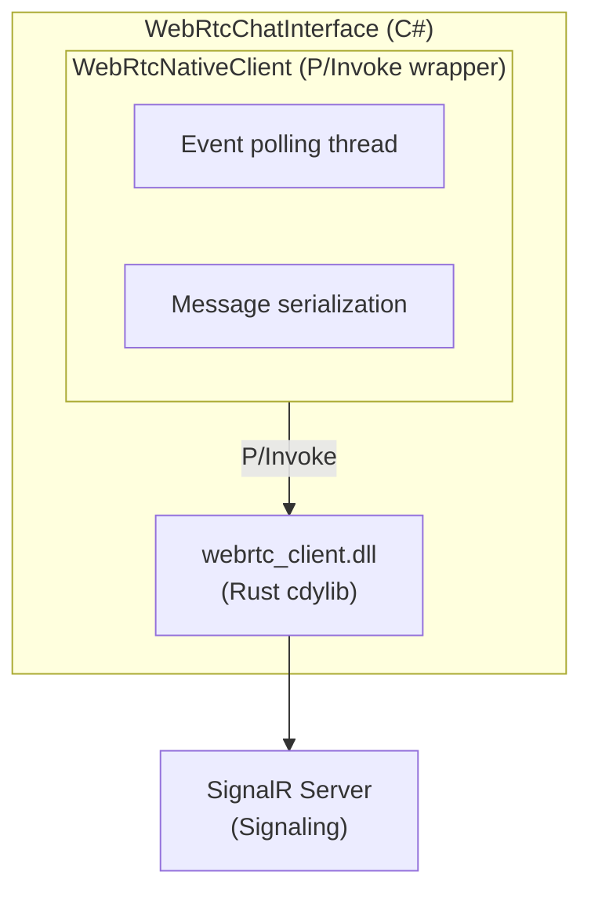

# Clawleash.Interfaces.WebRTC

WebRTC チャットインターフェースの完全実装。SignalR シグナリングサーバー経由で WebRTC P2P 接続を確立し、DataChannel でリアルタイム通信を行います。

## 機能

- **ネイティブ WebRTC**: Rust (webrtc-rs) ベースのネイティブライブラリによる高速な P2P 通信
- **フォールバック対応**: ネイティブライブラリがない場合はシミュレーションモードで動作
- **E2EE 対応**: DataChannel 通信のエンドツーエンド暗号化
- **STUN/TURN**: NAT 超え対応（STUN/TURN サーバー設定可能）
- **自動再接続**: SignalR 自動再接続とピア接続の自動復旧

## アーキテクチャ



## ネイティブライブラリのビルド

### 前提条件

- Rust 1.70 以降
- Cargo

### ビルド手順

```bash
# webrtc-client リポジトリに移動
cd ../webrtc-client

# Release ビルド
cargo build --release -p webrtc-client-sys

# 出力ファイルを Clowleash にコピー
# Windows x64:
copy target\release\webrtc_client.dll ..\Clowleash\Clawleash.Interfaces.WebRTC\Native\win-x64\

# Linux x64:
cp target/release/libwebrtc_client.so ../Clowleash/Clawleash.Interfaces.WebRTC/Native/linux-x64/

# macOS x64:
cp target/release/libwebrtc_client.dylib ../Clowleash/Clawleash.Interfaces.WebRTC/Native/osx-x64/
```

## 使用方法

### 設定

```csharp
var settings = new WebRtcSettings
{
    SignalingServerUrl = "http://localhost:8080/signaling",
    StunServers = new List<string>
    {
        "stun:stun.l.google.com:19302",
        "stun:stun1.l.google.com:19302"
    },
    TurnServerUrl = "turn:turn.example.com:3478",  // オプション
    TurnUsername = "user",
    TurnPassword = "password",
    EnableE2ee = true,
    IceConnectionTimeoutMs = 30000,
    MaxReconnectAttempts = 5
};
```

### 基本的な使用

```csharp
var chatInterface = new WebRtcChatInterface(settings, logger);

// イベントハンドラー
chatInterface.MessageReceived += (sender, args) =>
{
    Console.WriteLine($"Message from {args.SenderName}: {args.Content}");
};

// 開始
await chatInterface.StartAsync(cancellationToken);

// メッセージ送信
await chatInterface.SendMessageAsync("Hello, World!");

// 終了
await chatInterface.DisposeAsync();
```

## 設定オプション

| プロパティ | 説明 | デフォルト |
|-----------|------|-----------|
| `SignalingServerUrl` | SignalR シグナリングサーバー URL | `ws://localhost:8080/signaling` |
| `StunServers` | STUN サーバー URL リスト | Google STUN サーバー |
| `TurnServerUrl` | TURN サーバー URL | `null` |
| `TurnUsername` | TURN ユーザー名 | `null` |
| `TurnPassword` | TURN パスワード | `null` |
| `EnableE2ee` | E2EE 有効化 | `false` |
| `IceConnectionTimeoutMs` | ICE 接続タイムアウト | `30000` |
| `MaxReconnectAttempts` | 最大再接続試行回数 | `5` |
| `ReconnectIntervalMs` | 再接続間隔 | `5000` |
| `TryUseNativeClient` | ネイティブクライアント使用試行 | `true` |
| `DataChannelReliable` | DataChannel 信頼性モード | `true` |
| `HeartbeatIntervalMs` | ハートビート間隔 | `30000` |

## イベント

### MessageReceived

メッセージ受信時に発生するイベント。

```csharp
chatInterface.MessageReceived += (sender, args) =>
{
    // args.MessageId - メッセージ ID
    // args.SenderId - 送信者ピア ID
    // args.SenderName - 送信者名
    // args.Content - メッセージ内容
    // args.Timestamp - タイムスタンプ
    // args.Metadata["native"] - ネイティブクライアント使用フラグ
    // args.Metadata["encrypted"] - 暗号化フラグ
};
```

## シミュレーションモード

ネイティブライブラリが利用できない場合、インターフェースはシミュレーションモードで動作します。

- SignalR 経由でメッセージを中継
- 実際の P2P 通信は行わない
- 開発・テスト環境で使用可能

## トラブルシューティング

### "Native WebRTC library not found"

ネイティブライブラリが見つからない場合：
1. `webrtc-client` Rust プロジェクトをビルド
2. 適切なプラットフォームフォルダーに DLL/SO/DYLIB をコピー
3. または `TryUseNativeClient = false` でシミュレーションモードを使用

### "Architecture mismatch"

アプリケーションとライブラリのアーキテクチャが一致しない場合：
- x64 アプリケーション → x64 ライブラリ
- arm64 アプリケーション → arm64 ライブラリ

### ICE 接続タイムアウト

NAT 超えできない場合：
- STUN サーバーが正しく設定されているか確認
- TURN サーバーの使用を検討
- `IceConnectionTimeoutMs` を増加

## テスト

```bash
# 単体テスト
dotnet test Clawleash.Interfaces.WebRTC.Tests

# 統合テスト
# Terminal 1: Signaling Server
cd Clawleash.Server && dotnet run

# Terminal 2: Client 1
cd Clawleash && dotnet run

# Terminal 3: Client 2
cd Clawleash && dotnet run
```

## 関連プロジェクト

- [Clawleash.Server](../Clawleash.Server/README.md) - シグナリングサーバー
- [Clawleash.Interfaces.WebSocket](../Clawleash.Interfaces.WebSocket/README.md) - WebSocket インターフェース
- [Clawleash.Abstractions](../Clawleash.Abstractions/README.md) - 共有インターフェース

## ライセンス

MIT
