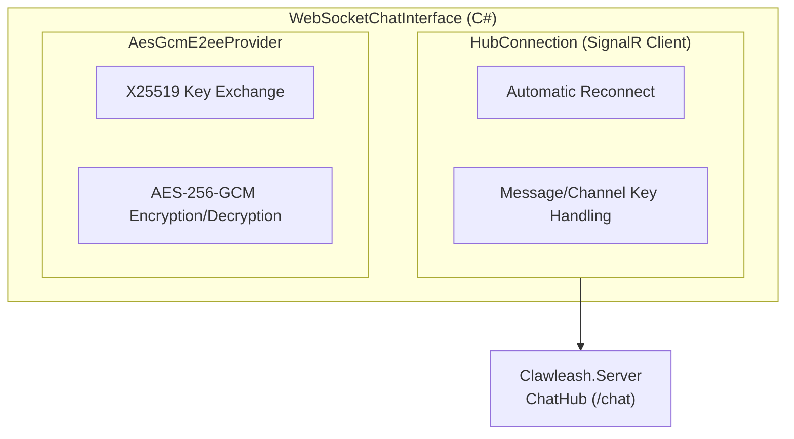
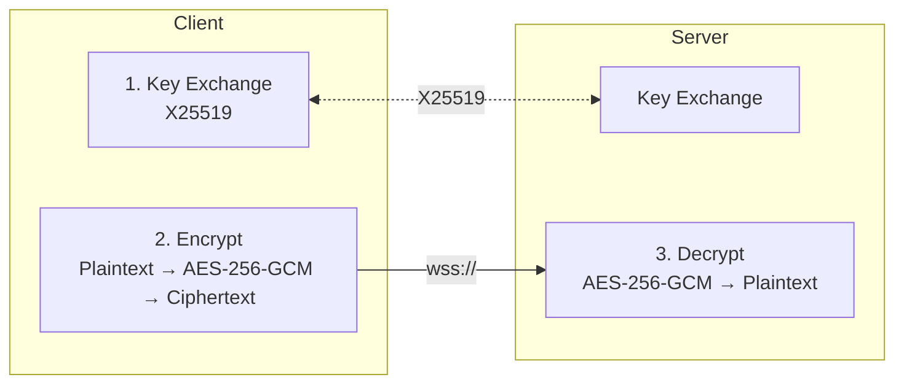

# Clawleash.Interfaces.WebSocket

A complete implementation of WebSocket chat interface. Uses SignalR client for real-time communication with the server, supporting E2EE (End-to-End Encryption).

## Features

- **SignalR Communication**: Real-time bidirectional communication via ASP.NET Core SignalR
- **E2EE Support**: End-to-end encryption using X25519 key exchange + AES-256-GCM
- **Channel Keys**: Per-channel encryption key management
- **Auto-Reconnect**: Automatic reconnection with exponential backoff
- **Streaming Send**: Support for batch sending of long messages

## Architecture



## E2EE Encryption Flow



## Usage

### Settings

```csharp
var settings = new WebSocketSettings
{
    ServerUrl = "wss://localhost:8080/chat",
    EnableE2ee = true,
    ReconnectIntervalMs = 5000,
    MaxReconnectAttempts = 10,
    HeartbeatIntervalMs = 30000,
    ConnectionTimeoutMs = 10000
};
```

### Basic Usage

```csharp
var chatInterface = new WebSocketChatInterface(settings, logger);

// Event handler
chatInterface.MessageReceived += (sender, args) =>
{
    Console.WriteLine($"Message from {args.SenderName}: {args.Content}");
    Console.WriteLine($"Encrypted: {args.Metadata["encrypted"]}");
};

// Start (also performs key exchange if E2EE enabled)
await chatInterface.StartAsync(cancellationToken);

// Join channel
await chatInterface.JoinChannelAsync("general");

// Send message
await chatInterface.SendMessageAsync("Hello!", replyToMessageId);

// Leave channel
await chatInterface.LeaveChannelAsync("general");

// Dispose
await chatInterface.DisposeAsync();
```

## Configuration Options

| Property | Description | Default |
|-----------|------|-----------|
| `ServerUrl` | SignalR server URL | `ws://localhost:8080/chat` |
| `EnableE2ee` | Enable E2EE (inherited from parent settings) | `false` |
| `ReconnectIntervalMs` | Reconnection interval | `5000` |
| `MaxReconnectAttempts` | Maximum reconnection attempts | `10` |
| `HeartbeatIntervalMs` | Heartbeat interval | `30000` |
| `ConnectionTimeoutMs` | Connection timeout | `10000` |

## Events

### MessageReceived

Event raised when a message is received.

```csharp
chatInterface.MessageReceived += (sender, args) =>
{
    // args.MessageId - Message ID
    // args.SenderId - Sender ID
    // args.SenderName - Sender name
    // args.Content - Message content (decrypted)
    // args.ChannelId - Channel ID
    // args.Timestamp - Timestamp
    // args.Metadata["encrypted"] - Whether it was encrypted
};
```

## Reconnection Policy

Automatic reconnection using exponential backoff:

```
Attempt 1: After 5 seconds
Attempt 2: After 10 seconds
Attempt 3: After 20 seconds
...
Maximum 60 second interval
```

Stops reconnecting after maximum attempts reached.

## Troubleshooting

### "WebSocket server URL is not configured"

Verify URL is set in `appsettings.json`:

```json
{
  "ChatInterface": {
    "WebSocket": {
      "Enabled": true,
      "ServerUrl": "wss://localhost:8080/chat",
      "EnableE2ee": true
    }
  }
}
```

### "Failed to connect to SignalR hub"

1. Verify Clawleash.Server is running
2. Verify URL is correct (`ws://` or `wss://`)
3. Check firewall settings

### "Key exchange failed"

1. Verify E2EE is enabled on server side
2. Verify server time is correct

### Messages Not Encrypted

- Verify `EnableE2ee` is set to `true`
- Verify channel key is set (`HasChannelKey`)

## Build

```bash
cd Clawleash.Interfaces.WebSocket
dotnet build
```

## Dependencies

- Microsoft.AspNetCore.SignalR.Client
- Clawleash.Abstractions

## Related Projects

- [Clawleash.Server](../Clawleash.Server/README-en.md) - SignalR server
- [Clawleash.Interfaces.WebRTC](../Clawleash.Interfaces.WebRTC/README-en.md) - WebRTC interface
- [Clawleash.Abstractions](../Clawleash.Abstractions/README-en.md) - Shared interfaces

## License

MIT
