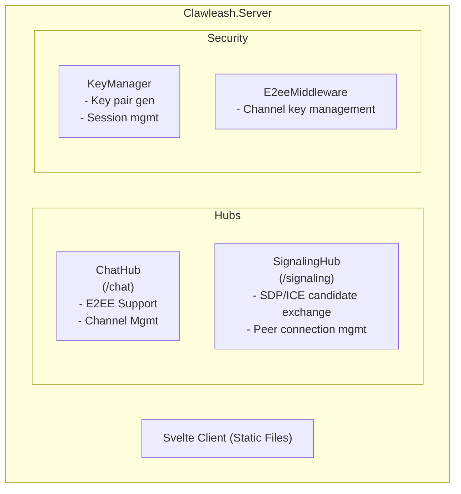
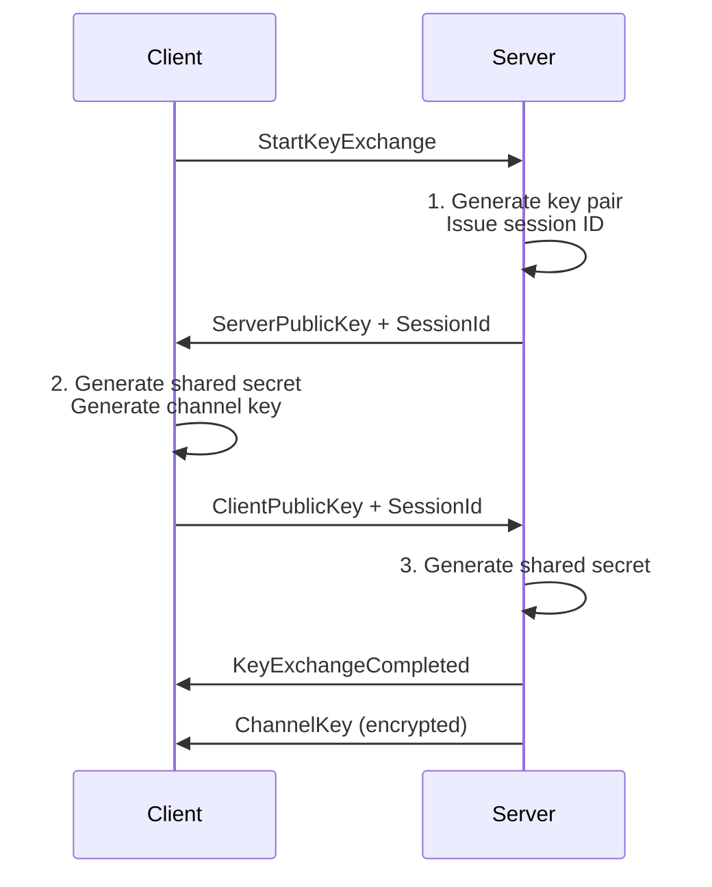

# Clawleash.Server

Clawleash's SignalR server component. Provides real-time communication with WebSocket and WebRTC clients, supporting E2EE (End-to-End Encryption).

## Features

- **SignalR Hub**: Real-time bidirectional communication
- **ChatHub**: Chat hub for WebSocket clients (E2EE support)
- **SignalingHub**: WebRTC signaling server
- **E2EE Key Management**: X25519 key exchange and channel key distribution
- **Svelte Client Delivery**: Serves SPA as static files

## Architecture



## Usage

### Starting

```bash
cd Clawleash.Server
dotnet run

# Or
dotnet run --project Clawleash.Server
```

### Endpoints

| Path | Description |
|------|-------------|
| `/` | Svelte SPA client |
| `/chat` | WebSocket ChatHub |
| `/signaling` | WebRTC signaling hub |

### Configuration

`appsettings.json`:

```json
{
  "Logging": {
    "LogLevel": {
      "Default": "Information"
    }
  },
  "AllowedOrigins": "https://yourdomain.com"
}
```

## ChatHub API

### Client → Server

| Method | Description |
|----------|------|
| `StartKeyExchange()` | Start E2EE key exchange |
| `CompleteKeyExchange(sessionId, publicKey)` | Complete key exchange |
| `SendMessage(content, channelId, senderName, encrypted, ciphertext)` | Send message |
| `JoinChannel(channelId)` | Join channel |
| `LeaveChannel(channelId)` | Leave channel |

### Server → Client

| Event | Description |
|----------|------|
| `MessageReceived` | Message received |
| `ChannelKey` | Channel key distribution |
| `KeyExchangeCompleted` | Key exchange completion notification |

## SignalingHub API

### Client → Server

| Method | Description |
|----------|------|
| `Register(peerId, metadata)` | Register peer |
| `Offer(targetPeerId, sdp)` | Send SDP offer |
| `Answer(targetPeerId, sdp)` | Send SDP answer |
| `IceCandidate(targetPeerId, candidate)` | Send ICE candidate |

### Server → Client

| Event | Description |
|----------|------|
| `PeerConnected` | Peer connection notification |
| `PeerDisconnected` | Peer disconnection notification |
| `Offer` | SDP offer received |
| `Answer` | SDP answer received |
| `IceCandidate` | ICE candidate received |

## CORS Configuration

### Development

```csharp
policy.WithOrigins("http://localhost:5173", "http://localhost:4173")
      .AllowAnyHeader()
      .AllowAnyMethod()
      .AllowCredentials();
```

### Production

Specify allowed origins in `AllowedOrigins` setting:

```json
{
  "AllowedOrigins": "https://app.yourdomain.com"
}
```

## E2EE Key Exchange Flow



## Svelte Client

Place Svelte application in `Client/` directory:

```
Client/
├── index.html
├── _framework/
│   └── blazor.webassembly.js
└── ...
```

Copied to `wwwroot/` during build.

## Troubleshooting

### "CORS policy blocked"

1. `localhost:5173` is allowed in development
2. Configure `AllowedOrigins` in production

### WebSocket Connection Drops

1. Verify WebSocket is allowed on proxy server
2. Check Keep-Alive settings

### E2EE Not Working

1. Verify `EnableE2ee` is set to `true` on both client and server
2. Verify time synchronization is correct

## Build

```bash
cd Clawleash.Server
dotnet build
```

## Dependencies

- Microsoft.AspNetCore.SignalR
- Clawleash.Abstractions

## Related Projects

- [Clawleash.Interfaces.WebSocket](../Clawleash.Interfaces.WebSocket/README-en.md) - WebSocket client
- [Clawleash.Interfaces.WebRTC](../Clawleash.Interfaces.WebRTC/README-en.md) - WebRTC client
- [Clawleash.Abstractions](../Clawleash.Abstractions/README-en.md) - Shared interfaces

## License

MIT
