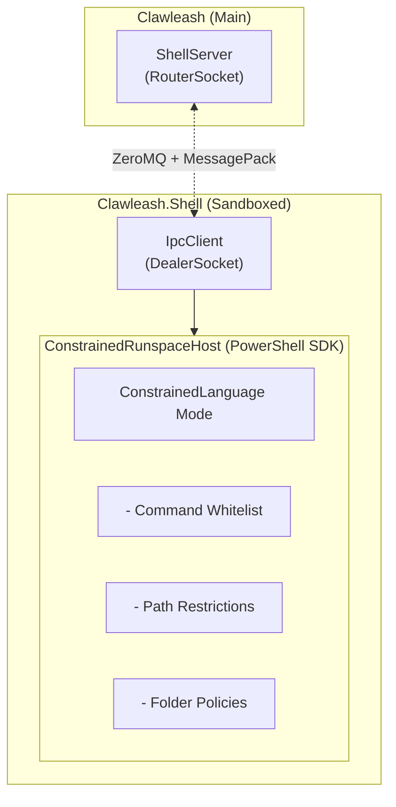

# Clawleash.Shell

Clawleash's sandbox execution process. Communicates with the main application via IPC using ZeroMQ + MessagePack, executing commands in a constrained PowerShell environment.

## Overview

Clawleash.Shell operates as an isolated process with the following responsibilities:

- **IPC Client**: Connects to main app via ZeroMQ (DealerSocket)
- **PowerShell Execution**: Executes commands in constrained PowerShell Runspace
- **Sandbox**: Runs isolated in AppContainer (Windows) / Bubblewrap (Linux)

## Architecture



## Usage

### Starting

Clawleash.Shell is typically started automatically from the main application:

```bash
# Manual start (for debugging)
Clawleash.Shell --server tcp://localhost:5555

# Verbose logging enabled
Clawleash.Shell --server tcp://localhost:5555 --verbose
```

### Command Line Arguments

| Argument | Short | Description |
|------|------|------|
| `--server <address>` | `-s` | ZeroMQ server address (required) |
| `--verbose` | `-v` | Verbose logging output |

## IPC Protocol

### Communication Specification

| Item | Specification |
|------|---------------|
| Protocol | ZeroMQ (Router/Dealer) |
| Serialization | MessagePack |
| Direction | Main (Server) ← Shell (Client) |

### Message Types

| Message | Direction | Description |
|-----------|------|------|
| `ShellInitializeRequest` | S → M | Initialization request |
| `ShellInitializeResponse` | M → S | Initialization response |
| `ShellExecuteRequest` | M → S | Command execution request |
| `ShellExecuteResponse` | S → M | Execution result |
| `ToolInvokeRequest` | M → S | Tool invocation request |
| `ToolInvokeResponse` | S → M | Tool execution result |
| `ShellPingRequest` | M → S | Health check |
| `ShellPingResponse` | S → M | Response |

## PowerShell Constraints

### ConstrainedLanguage Mode

Operates in ConstrainedLanguage mode by default:

- **Allowed**: Basic commands, pipelines, variables
- **Prohibited**: .NET method calls, Add-Type, script blocks

### Command Whitelist

Only allowed commands can be executed:

```powershell
# Example allowed commands
Get-Content, Set-Content, Get-ChildItem
New-Item, Remove-Item, Copy-Item, Move-Item
Write-Output, Write-Error
```

### Path Restrictions

Access control based on folder policies:

```json
{
  "FolderPolicies": [
    {
      "Path": "C:\\Projects",
      "Access": "ReadWrite",
      "Network": "Allow",
      "Execute": "Allow"
    },
    {
      "Path": "C:\\Projects\\Secrets",
      "Access": "Deny"
    }
  ]
}
```

## Sandbox

### Windows (AppContainer)

- Capability-based access control
- File system, network, registry isolation
- Runs at low integrity level

### Linux (Bubblewrap)

- Namespace isolation (PID, Network, Mount, User)
- Resource limits via cgroups
- seccomp filter

## Project Structure

```
Clawleash.Shell/
├── Program.cs                 # Entry point
├── IPC/
│   └── IpcClient.cs          # ZeroMQ client
├── Hosting/
│   └── ConstrainedRunspaceHost.cs  # PowerShell host
└── Cmdlets/
    └── ...                   # Custom cmdlets
```

## Troubleshooting

### "Server address not specified"

Specify the `--server` argument:

```bash
Clawleash.Shell --server tcp://localhost:5555
```

### "Failed to connect to Main app"

1. Verify main application is running
2. Verify server address is correct
3. Check firewall settings

### PowerShell Command Fails

1. Verify command is in whitelist
2. Verify path is allowed by folder policies
3. Check ConstrainedLanguage mode restrictions

## Build

```bash
cd Clawleash.Shell
dotnet build
```

## Dependencies

- NetMQ (ZeroMQ)
- MessagePack
- PowerShell SDK
- Clawleash.Contracts

## Related Projects

- [Clawleash](../README-en.md) - Main application
- [Clawleash.Contracts](../Clawleash.Contracts) - IPC message definitions

## License

MIT
